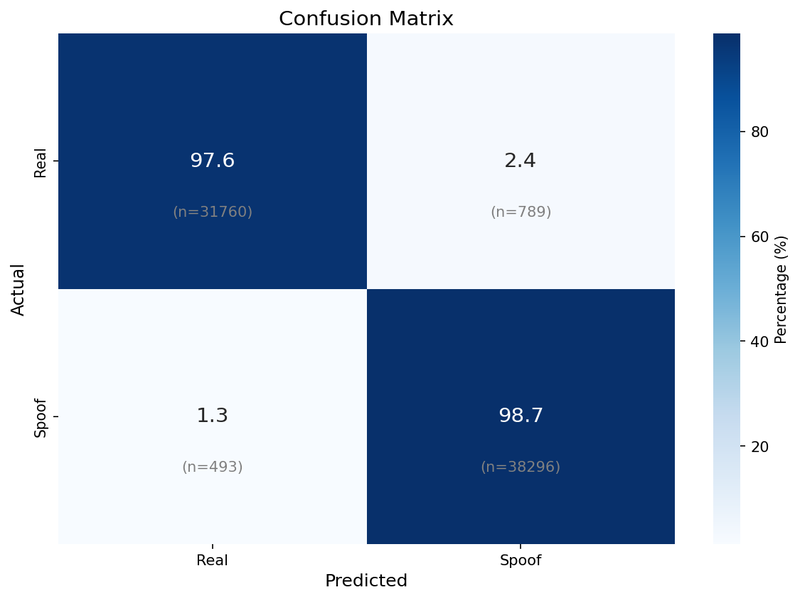
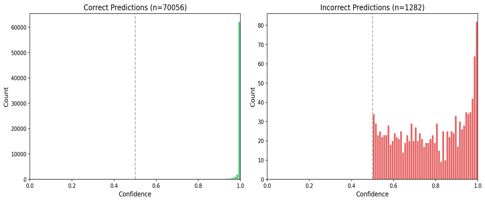
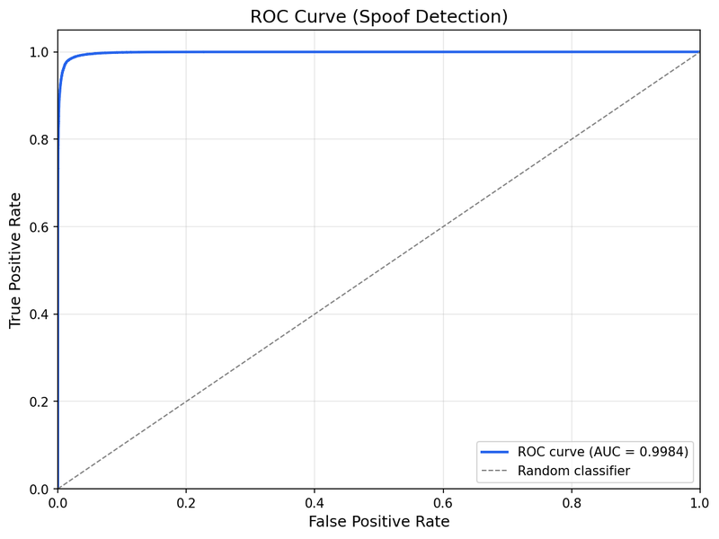
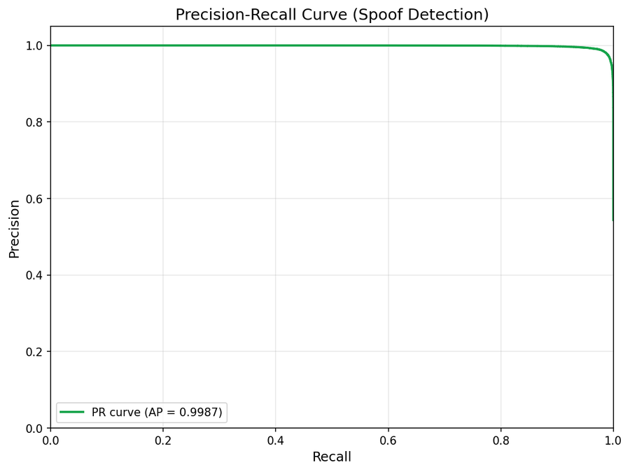

# Model Performance Metrics

Benchmark results on CelebA Spoof (70k+ test samples).

## Current Best

### Regular Model (FP32)

| Metric | Value |
|:-------|:-----:|
| **Overall Accuracy** | **98.20%** |
| Real Accuracy | 97.58% |
| Spoof Accuracy | 98.73% |
| **ROC-AUC** | **0.9984** |
| **Average Precision** | **0.9987** |

#### Visualizations

  
  

  

  

---

### Quantized Model (INT8)

| Metric | Value |
|:-------|:-----:|
| **Overall Accuracy** | **98.20%** |
| Real Accuracy | 97.55% |
| Spoof Accuracy | 98.73% |
| **ROC-AUC** | **0.9984** |
| **Average Precision** | **0.9987** |

#### Visualizations

  
  

  

  

---

## Previous Best

### Regular Model (FP32)

| Metric | Value |
|:-------|:-----:|
| **Overall Accuracy** | **97.80%** |
| Real Accuracy | 98.16% |
| Spoof Accuracy | 97.50% |
| **ROC-AUC** | **0.9978** |
| **Average Precision** | **0.9981** |

#### Visualizations

  
  

  

  

---

### Quantized Model (INT8)

| Metric | Value |
|:-------|:-----:|
| **Overall Accuracy** | **97.79%** |
| Real Accuracy | 98.15% |
| Spoof Accuracy | 97.49% |
| **ROC-AUC** | **0.9978** |
| **Average Precision** | **0.9981** |

#### Visualizations

  
  

  

  

---

## Notes

**Improvements over previous best:**
- Accuracy: 97.80% → 98.20% (+0.40%)
- ROC-AUC: 0.9978 → 0.9984
- AP: 0.9981 → 0.9987

**Quantization:**
- No accuracy drop after INT8 quantization
- File size reduced to 600 KB (67% smaller)
- Same ROC-AUC and AP scores
