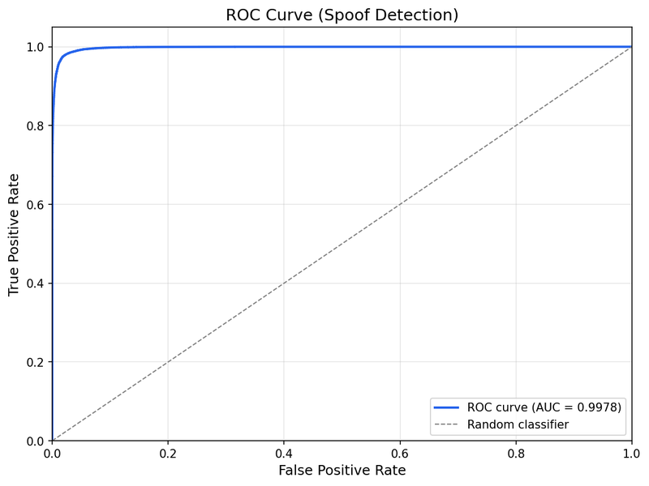
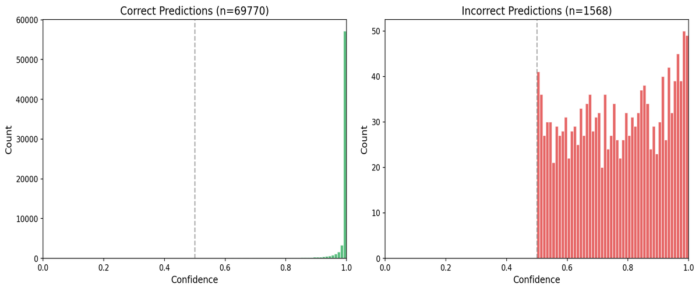
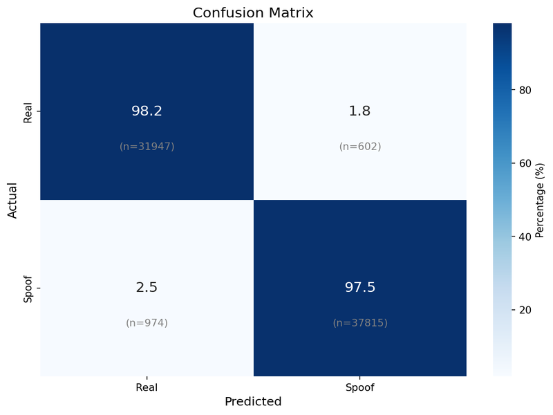
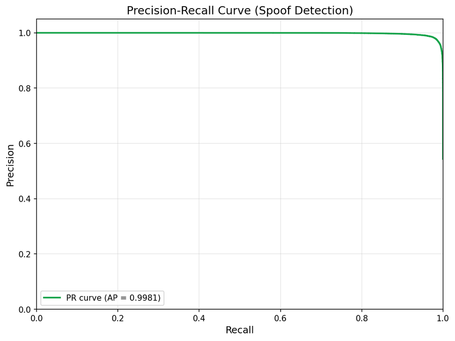

# Previous Model Results

Archived metrics from earlier model versions.

## 97.80% Model

### Regular Model (FP32)

| Metric | Value |
|:-------|:-----:|
| **Overall Accuracy** | **97.80%** |
| Real Accuracy | 98.16% |
| Spoof Accuracy | 97.50% |
| **ROC-AUC** | **0.9978** |
| **Average Precision** | **0.9981** |

#### Visualizations

  
  

  

  

---

### Quantized Model (INT8)

| Metric | Value |
|:-------|:-----:|
| **Overall Accuracy** | **97.79%** |
| Real Accuracy | 98.15% |
| Spoof Accuracy | 97.49% |
| **ROC-AUC** | **0.9978** |
| **Average Precision** | **0.9981** |

#### Visualizations

  
  

  

  

---

## Comparison: Current vs Previous Best

### Regular Models

| Metric | Previous | Current | Change |
|:-------|:--------:|:-------:|:------:|
| **Overall Accuracy** | 97.80% | **98.20%** | +0.40% |
| Real Accuracy | 98.16% | 97.58% | -0.58% |
| Spoof Accuracy | 97.50% | **98.73%** | +1.23% |
| **ROC-AUC** | 0.9978 | **0.9984** | +0.0006 |
| **Average Precision** | 0.9981 | **0.9987** | +0.0006 |

### Quantized Models

| Metric | Previous | Current | Change |
|:-------|:--------:|:-------:|:------:|
| **Overall Accuracy** | 97.79% | **98.20%** | +0.41% |
| Real Accuracy | 98.15% | 97.55% | -0.60% |
| Spoof Accuracy | 97.49% | **98.73%** | +1.24% |
| **ROC-AUC** | 0.9978 | **0.9984** | +0.0006 |
| **Average Precision** | 0.9981 | **0.9987** | +0.0006 |

---

## What Changed

Current model (98.20%) vs this version (97.80%):

- +0.40% overall accuracy
- +1.23% spoof detection (better at catching fakes)
- -0.58% real face accuracy (minor trade-off)
- Higher ROC-AUC and AP scores

All tested on CelebA Spoof (70k+ samples).

---

**[← Back to README](../README.md)** | **[Current Metrics →](METRICS.md)**
